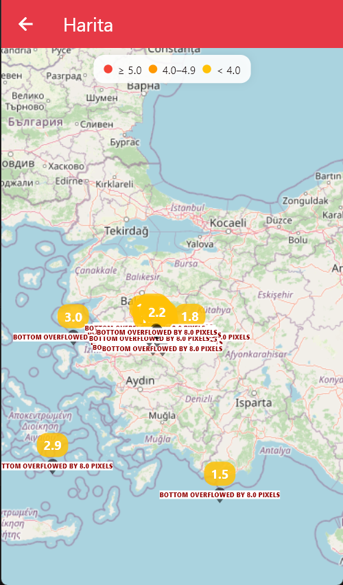

#  EarthquakeAlert

**EarthquakeAlert**, Kandilli Rasathanesi, AFAD, USGS ve EMSC gibi farklı gözlemevlerinden **gerçek zamanlı deprem verilerini** toplayan, kullanıcıları anında bilgilendiren ve modern arayüzüyle kolay kullanım sağlayan bir Flutter mobil uygulamasıdır.  


---

##  Özellikler

- **Gerçek Zamanlı Deprem Takibi**
  - Kandilli, AFAD, USGS ve EMSC API’lerinden veri çekme
  - 2 saniyede bir otomatik güncelleme
  - Çapraz doğrulama ve tekrar kayıtların filtrelenmesi

- **Deprem Detayları**
  - Büyüklük (ML, Mw, Md) bilgisi
  - Derinlik ve kullanıcı konumuna uzaklık hesaplama
  - Son 30 gün deprem geçmişine erişim

- **Veri Görselleştirme**
  - Canlı sismograf simülasyonu
  - Büyüklük zaman çizelgeleri
  - Derinlik dağılım grafikleri
  - Isı haritaları ve trend analizleri

- **Kullanıcı Dostu Özellikler**
  - Offline destek (önbellekten veri + offline harita)
  - Push bildirim entegrasyonu
  - Tema desteği (Açık / Koyu)
  - Acil durum çantası rehberi
  - Quiz & checklist ile etkileşimli içerik

---

##  Ekran Görüntüleri

| Ana Sayfa | Deprem Listesi | Detay | Ayarlar |
|-----------|----------------|-------|---------|
|  |  |  |  |

| Analiz | Harita | Çanta | Bilgi |
|--------|--------|-------|-------|
|  |  |  |  |

---

##  Kullanılan Teknolojiler

- [Flutter](https://flutter.dev/) – UI geliştirme
- [Dart](https://dart.dev/) – Programlama dili
- [SharedPreferences](https://pub.dev/packages/shared_preferences) – Yerel veri saklama
- [Provider](https://pub.dev/packages/provider) – State management
- [Dio](https://pub.dev/packages/dio) – API entegrasyonu
- [Google Maps Flutter](https://pub.dev/packages/google_maps_flutter) – Harita entegrasyonu

---

##  Kurulum

Projeyi kendi cihazında çalıştırmak için:

```bash
# Repoyu klonla
git clone https://github.com/sebahattinn/Flutter_EarthquakeAlert.git

cd Flutter_EarthquakeAlert

# Paketleri yükle
flutter pub get

# Uygulamayı çalıştır
flutter run
